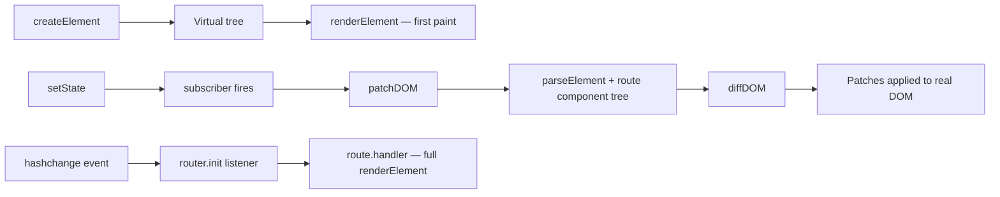

# Mini Framework — Developer Guide

   

> A dependency-free UI toolkit: virtual elements, hash-based routing, and a diff/patch engine, all in a handful of plain `.js` files.

This guide is organized around three questions you'll likely have, in order:

- **What's in the box?** → [Feature Map](#feature-map)
- **How do I build a UI with it?** → [Building UI](#building-ui)
- **What actually happens under the hood?** → [Internals](#how-it-all-fits-together)

There's also a full [Module Reference](#module-reference) and a walkthrough of the bundled [TodoMVC demo](#inside-the-todomvc-demo) at the bottom.

---

## Feature Map

The whole DOM-facing engine — creating elements, rendering them, diffing, and patching — sits in a single folder, **`src/vdom/*.js`**. That's a deliberate choice: those pieces all operate on the same virtual-node shape and share low-level helpers (`setDomAttribute`, `setEventListener`, `createActualNode`), so splitting them apart would mostly add import overhead without adding clarity.

| Piece | Lives in | Job |
|---|---|---|
| Virtual elements | `src/vdom/element.js` | Describe UI as plain objects via `createElement`, instead of calling DOM APIs by hand |
| First-paint rendering | `src/vdom/element.js` | Walk a virtual tree and materialize real DOM nodes (`renderElement`) |
| Diffing & patching | `src/vdom/differ.js` `src/vdom/patcher.js` | Compare the live DOM against a freshly-built tree and touch only what changed (`diffDOM`, `patchDOM`, `parseElement`) |
| State manager | `src/stateManager.js` | `getState` / `setState` / `subscribe` — a tiny observable store |
| Hash router | `src/router.js` | Map `#/`, `#/active`, etc. to handlers via a `Router()` instance |

> [!TIP]
> **Mental model in one line:** build a description of the UI as data → paint it once → whenever state changes, build a *new* description, diff it against what's on screen, and patch only the delta.

The bundled **TodoMVC** app (`todomvc/`) is the reference implementation — it exercises every piece above: lists, events, state, routing, and patched updates.

---

##  Building UI

Everything starts with `createElement`, exported from `src/vdom.js`:

```js
createElement(tagName, attributes = {}, events = {}, ...children)
```

Calling it doesn't touch the browser at all — it just returns a plain object:

```js
{
  tagName: "button",
  attributes: { class: "save-btn" },
  events: { click: handleClick },
  children: [ { tagName: "text", content: "Save" } ]
}
```

<details>
<summary>ℹ️ A couple of quality-of-life conveniences baked into <code>createElement</code></summary>

- Any `string` or `number` passed as a child is auto-wrapped into `{ tagName: "text", content: "..." }` — you never build text nodes by hand.
- Children arrays are flattened, so `...items.map(toElement)` just works as a spread argument.

</details>

To get a virtual tree onto the actual page, hand it to `renderElement`:

```js
import { createElement, renderElement } from "mini-framework/src/vdom.js";

const root = document.getElementById("root");
renderElement(true, root, /* one or more virtual elements */);
```

| Argument | Meaning |
|---|---|
| `true` / `false` (1st) | `true` wipes the parent (`innerHTML = ""`) first; `false` appends without clearing |
| `root` (2nd) | The real DOM node to render into |
| `...elements` | One or more virtual elements. `null` / `false` are ignored, which makes `condition && createElement(...)` a valid inline conditional |

###  Giving an element attributes

Attributes are the **2nd** argument:

```js
const input = createElement(
  "input",
  {
    id: "todo-input",
    class: "new-todo",
    type: "text",
    placeholder: "What needs to be done?",
  },
  {}
);
```

Toggle an attribute conditionally by spreading a computed object in:

```js
const checkboxState = isCompleted ? { checked: true } : {};

createElement("input", { class: "toggle", type: "checkbox", ...checkboxState }, {});
```

> [!NOTE]
> `checked` gets special treatment inside `setDomAttribute`: it flips the live `.checked` **property** on the element *and* toggles the HTML attribute, so the checkbox's visual state stays correct even after a patch — setting the attribute alone wouldn't do that reliably.

###  Wiring up an event

Events go in the **3rd** argument, keyed by DOM event name:

```js
const button = createElement(
  "button",
  { class: "save-btn" },
  { click: () => console.log("Saved") },
  "Save"
);
```

Internally this becomes an `addEventListener("click", ...)` call via the `setEventListener` helper. You can also use `onClick`-style keys directly on the attributes object — both routes end up calling the same helper:

```js
createElement("button", { onClick: () => console.log("Saved") }, {}, "Save");
```

> [!TIP]
> `setEventListener` remembers which handler is currently attached per event type on each element. Re-registering the same event type (which happens during a patch) swaps the old listener out first, instead of silently stacking duplicate listeners.

###  Nesting elements

Extra arguments after `events` are children — pass more `createElement(...)` calls:

```js
const card = createElement(
  "div",
  { class: "card" },
  {},
  createElement("h2", {}, {}, "Profile"),
  createElement("p", {}, {}, "Nested inside the card.")
);
```

```html
<div class="card">
  <h2>Profile</h2>
  <p>Nested inside the card.</p>
</div>
```

Building a list is just spreading a `.map()` result — this is exactly what `components/Home.js` does when it hands `ListItem()`'s output to a `<ul>`:

```js
createElement("ul", { class: "todo-list" }, {}, ...items.map(toListItem));
```

<details>
<summary>▶️ Full example — element + attributes + event + nesting, together</summary>

```js
import { createElement, renderElement } from "mini-framework/src/vdom.js";

const root = document.getElementById("root");

const app = createElement(
  "section",
  { class: "app" },
  {},
  createElement("h1", {}, {}, "Mini Framework"),
  createElement(
    "button",
    { class: "primary-btn" },
    { click: () => alert("Button clicked") },
    "Click me"
  )
);

renderElement(true, root, app);
```

</details>

---

##  How It All Fits Together

The core philosophy: **treat the UI as a value first, and only touch the real DOM to reconcile it with that value.**

### 1️ Description — virtual elements aren't DOM nodes

`createElement` returns data, full stop. No `document.createElement` happens here. That's what makes virtual trees cheap to build, compare, and even test without a browser.

### 2️ First paint — recursive rendering

`renderElement(clear, parent, ...elements)` walks the tree once:

1. Clears `parent` first if `clear` is `true`.
2. For each element: text nodes become `createTextNode`; everything else becomes `createElement`, gets its attributes/events applied, recurses into its children, then gets appended.

### 3️ Reactivity — state containers

`createState(initialState)` (from `src/stateManager.js`) hands back three functions:

```js
import { createState } from "mini-framework/src/stateManager.js";

export const list = createState({ list: [] });

list.subscribe((state) => {
  // fires after every setState — typically triggers patchDOM(router)
});
```

| Method | Behavior |
|---|---|
| `getState()` | Returns the current state value |
| `setState(patch)` | Shallow-merges `{ ...state, ...patch }`, then runs every subscriber |
| `subscribe(fn)` | Registers `fn`; returns an unsubscribe function |

### 4️ Navigation — the hash router

`src/router.js` exports a factory, `Router()`. Each app creates its own instance:

```js
import Router from "mini-framework/src/router.js";

const router = Router();

router.route = {
  path: "/active",
  handler: () => { /* full renderElement(true, ROOT_NODE, ...) redraw */ },
  component: () => { /* virtual tree describing this route, for diffing */ },
};

router.init();               // renders the current route, then listens for hashchange
router.navigate("/active");  // sets location.hash programmatically
```

> [!IMPORTANT]
> `route` is a **setter**, not a plain field — every assignment *registers* a route rather than overwriting a single value. Assigning the same `path` twice replaces that one entry. The special path `"*"` acts as the fallback when nothing else matches.

### 5️ Reconciliation — diff & patch

Rather than re-rendering everything on every state change, `patchDOM(router)` does this:

1. **`parseElement(parent)`** — reads the *current* DOM back into a virtual tree. (Event listeners can't be recovered this way, so extracted nodes always come back with an empty `events` object.)
2. **`routeToVDom(router)`** — asks the active route's `component` for the *target* tree.
3. **`diffDOM(oldTree, newTree, path)`** — recursively walks both trees, emitting a flat list of changes, each tagged with a positional path like `root.children[0].children[2]`.
4. Each change is applied via **`getNodeFromPath`** + the matching low-level helper — `setDomAttribute`, `removeDomAttribute`, `setEventListener`, `removeEventListener`, or a DOM insert/remove/replace built with `createActualNode`.

Diff/patch types in play: `TEXT`, `ATTRIBUTE`, `REMOVE_ATTRIBUTE`, `EVENT`, `REMOVE_EVENT`, `REPLACE`, `ADD`, `REMOVE`.

> [!WARNING]
> **Known trade-off:** children are diffed **by index**, not by a stable key (`oldChildren[i]` vs. `newChildren[i]`). Inserting or deleting an item in the middle of a list shifts every sibling after it, so the diff can end up patching more nodes than a keyed algorithm would. Fine for small/append-mostly lists; worth revisiting if list reordering becomes common.

###  Putting it all on one diagram



**TL;DR:**

- `createElement` → describe
- `renderElement` → paint (first load, or a route's full `handler`)
- `createState` + `subscribe` → react
- `Router` + `.route` + `.init()` → navigate
- `diffDOM` + `patchDOM` → reconcile efficiently, driven by each route's `component`

One shape ties it all together: `{ tagName, attributes, events, children }`, or `{ tagName: "text", content }` for text.

---

##  Module Reference

| File | Exports |
|---|---|
| `src/vdom.js` | `ROOT_NODE`, `createElement`, `renderElement`, `diffDOM`, `patchDOM`, `parseElement`, `routeToVDom`, `getNodeFromPath`, `createVirtualRootContainer`, `createActualNode`, `setEventListener`, `removeEventListener`, `setDomAttribute`, `removeDomAttribute` |
| `src/router.js` | default export `Router` → `{ routes, route (setter), init(), navigate(path) }` |
| `src/stateManager.js` | `createState` → `{ getState, setState, subscribe }` |

---

##  Inside the TodoMVC Demo

The demo lives entirely under `todomvc/` and shows the three modules above wired into a real app:

| File | What it does |
|---|---|
| `globals.js` | Sets up shared state: `list` (the todos), `listType` (current filter — `all` / `active` / `completed`), `data` (derived values like the active-item `count`) |
| `helpers.js` | Pure mutation functions over `list`/`data` — `addItem`, `removeItem`, `removeCompleted`, `markItemAsCompleted`, `markAllItemsAsCompleted`, `changeItemContent`, plus `generateUniqueId` and `countActiveTasks` |
| `components/Home.js` | Assembles the header (new-todo input + "toggle all"), the `<ul>` of todos via `ListItem()`, and `ActionsBar()` |
| `components/ListItem.js` | Renders one `<li>` per todo matching the active filter; wires toggle / edit / delete |
| `components/ActionsBar.js` | Item counter, the All / Active / Completed filter links, "Clear completed" |
| `components/Footer.js` | Static footer, rendered once straight into `document.body`, outside the routed `#root` |
| `components/NotFound.js` | Minimal `404` view, ready to plug into a route's `handler` / `component` |
| `main.js` | Glue code: creates the `Router`, subscribes every state container to `patchDOM(router)`, registers `/`, `/active`, `/completed`, `*`, then calls `router.init()` |
| `index.html` | Loads `main.js` as a module and maps the `mini-framework/` bare specifier to `/node_modules/@thakkou/mini-framework/` via an import map |

###  Running it locally

Because the app resolves `mini-framework/...` through an import map, it needs to be **served over HTTP** — bare specifiers don't resolve when you open the HTML file directly via `file://`.

```bash
cd todomvc
npm install        # pulls in @thakkou/mini-framework via the local file: dependency
npx serve .         # or: python3 -m http.server 8000
```

Then visit the served URL in your browser.

Or scaffold a fresh copy anywhere using the bundled CLI:

```bash
npx @thakkou/mini-framework my-todo-app
cd my-todo-app
npm install
```